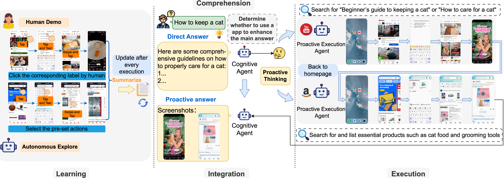

# 🤖 AppAgent - Pro

<p align="center">
  
</p>

<p align="center">
  <a href="https://www.dropbox.com/scl/fi/hvzqo5vnusg66srydzixo/AppAgent-Pro-demo-video.mp4?rlkey=o2nlfqgq6ihl125mcqg7bpgqu&st=9345yd8k&dl=0">Demo Video</a> •
  <a href="LICENSE">License</a>
</p>

<p align="center">
    <a href="https://opensource.org/licenses/MIT">
        
    </a>
    <a href="https://img.shields.io/badge/Python-3.9+-blue">
        
    </a>
    <a href="https://github.com/LaoKuiZe/AppAgent-Pro">
        
    </a>
</p>

**AppAgent-Pro** is a proactive AI agent system that goes beyond text-based answers. Built as an enhancement to the original [AppAgent](https://github.com/TencentQQGYLab/AppAgent), it can **actively interact with Android apps (YouTube, Amazon) via ADB**, decide whether external information is needed, and combine retrieved results with LLM-generated responses.

Unlike traditional assistants that passively respond with pretrained knowledge, **AppAgent-Pro** functions as a **proactive multimodal mobile agent** with real-world execution capabilities. It follows a unified, end-to-end pipeline of:

### 🧠 Learn → Comprehension → Execution → Integration

1. **Learn** — Before deployment, AppAgent-Pro explores how to operate target Android apps by analyzing UI layouts and recording action sequences. This is achieved via either autonomous exploration or human-guided demonstrations.
2. **Comprehension** — Upon receiving a user query, GPT-4o is used to generate an initial answer and infer potential sub-tasks. This step leverages LLM reasoning to form a high-level plan. The agent proactively assesses whether external information is needed, determines which app(s) to launch (YouTube, Amazon), and formulates actionable sub-tasks for each.
3. **Execution** — It then simulates real human interactions on mobile apps (clicking, swiping, entering text) via ADB, executing the sub-tasks and collecting content such as screenshots, product details, or video metadata.
5. **Integration** — Finally, the agent merges the LLM-generated textual answer with the app-acquired content to produce a structured, enriched response — delivering a truly **proactive, context-aware output**.

> 🎯 This enables AppAgent-Pro to act not only as a language model, but as a real-world **task executor** — bridging LLM cognition with interactive app control.

---

## 🎬 Strategy Comparison Demo

We demonstrate how AppAgent-Pro handles three different scenarios depending on the complexity of the query and the need for external resources.

### ✅ Scenario 1: **No External App Needed**  
The query is simple and can be answered entirely using the LLM’s internal knowledge.

> 🧠 _“How many hours are there in one day?” → No sub-tasks needed._

- **Video Demonstration**  
  <p align="center">
    <video src="https://github.com/user-attachments/assets/5fc5f83b-dbe5-4f2e-b523-28ba258962d6" controls width="600"></video>
  </p>

---

### ✅ Scenario 2: **One External App Used**  
The agent chooses to enhance the answer using one external app (e.g., YouTube).

> 🎥 _“How to upload a video on Youtube?” → Add a YouTube video tutorial._

- **Video Demonstration**  
  <p align="center">
    <video src="https://github.com/user-attachments/assets/4a6ce824-4a26-4199-a4ff-5332e5f066a3" controls width="600"></video>
  </p>

---

### ✅ Scenario 3: **Two External Apps Used**  
The agent enhances its response with **both** YouTube and Amazon.

> 🐈 _“How to keep a cat?” → Add product picture (Amazon) and assembly guide videos (YouTube)._

- **Video Demonstration**  
  <p align="center">
    <video src="https://github.com/user-attachments/assets/a9b5e849-3a0f-46c2-9ac6-8a35b2d3750b" controls width="600"></video>
  </p>

---

## ⚡ Quick Start

### ⚙️ Step 1: Prerequisites

1. Install [ADB](https://developer.android.com/tools/adb) on your PC.
2. Enable **USB debugging** on your Android device (in Developer Options).
3. Connect your device via USB.
4. (Optional) No real device? Use the Android Studio emulator and install apps via APK drag-and-drop.

   

5. Clone this repo and install dependencies:
   ```bash
   cd AppAgent-Pro
   pip install -r requirements.txt
   ```

---

### ⚙️ Step 2: Configure the Agent

Edit `config.yaml` with:

- 🔑 `openai_api_key`: Your OpenAI key with GPT-4o access.
- 🌐 `openai_base`: (Optional) Base URL if using a proxy.
- ⏱️ `request_interval`: Seconds between API calls.
- 📜 `AUTO_DOC`:If set to `true`, the system will automatically generate a document after each sub-task finishes.

---

### 🔍 Step 3: Exploration Phase

AppAgent-Pro needs to understand how to interact with the target apps.

#### 🧑‍🏫 Option 1: Human Demonstration (Recommended)
You show the agent how to operate the app.
```bash
python learn.py
```

#### 🤖 Option 2: Autonomous Exploration
The agent explores app UI on its own.
```bash
python learn.py
```

---

### 🚀 Step 4: Deployment Phase

Once exploration is done, launch the demo web app:

```bash
streamlit run ./scripts/run_demo.py
```

AppAgent-Pro will decide which apps to use (if any), generate sub-tasks, and present a unified response including external resources.

---

## 📃 License

This project is licensed under the **MIT License**. See [LICENSE](./LICENSE) for full details.
